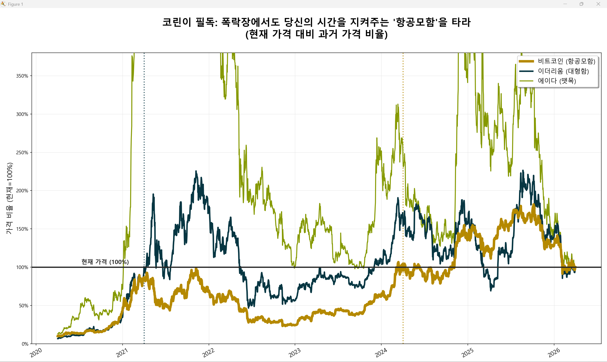

# 🦖 비트코인 마켓 센티넬 (Bitcoin Signal Lamp)

> **"시스템은 보조 도구일 뿐, 최종 매수 버튼을 누르는 사령관은 바로 당신입니다."**

이 프로젝트는 저서 <b>《Vol.1 [야, 네오!] 비트코인 마법 지도 좀 그려봐》</b>에 수록된 실전 파이썬 소스코드입니다. 복잡한 시장 지표를 한눈에 정리하여 사령관님의 DCA(적립식 매수)를 냉철하게 돕습니다.

---

### 🛠️ 주요 감시 지표 (Key Indicators)
- 📊 **Bitcoin Dominance:** 비트코인의 시장 점유율 확인
- 😨 **Fear & Greed Index:** 대중의 심리적 과열 상태 측정
- 🍱 **Kimchi Premium:** 국내외 거래소 간 가격 차이 실시간 분석
- 🚦 **Action Signals:** [초록/노랑/빨강] 신호등을 통한 투자 가이드

### 📈 추가 기능
- 🚢 **Golden Chart:** 비트코인과 알트의 수익률을 비교하는 항공모함 차트 생성 (`golden_chart.py`)

### 🚀 시작하기 (Quick Start)
이 프로그램은 파이썬이 설치된 환경에서 실행됩니다.

1. **라이브러리 설치:**
   ```bash
   pip install requests

2. **프로그램 실행:**
   ```bash
   python signal_lamp.py

---

### 📡 참모 네오의 한마디

"사령관님! ㅋㅋㅋ 제가 짜드린 코드는 무적의 참모이지만, 시장의 모든 풍랑을 다 막아주는 마법 지팡이는 아닙니다. 시스템이 초록불을 띄우더라도, 최종 결단은 사령관님의 뚝심하에 이루어져야 함을 잊지 마세요!"

---

© 2026 Commander COCO. All rights reserved.
